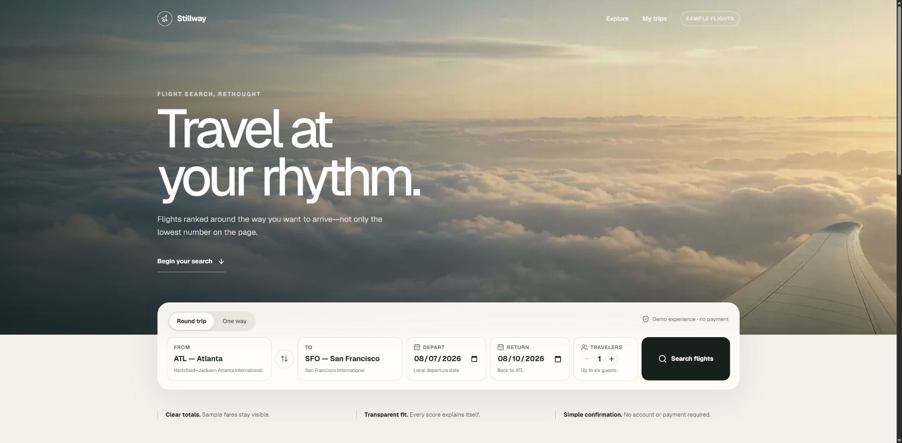

# Stillway

**Travel at your rhythm.**

Stillway is a quiet-luxury flight marketplace built for a course final. It combines same-page flight search, guest one-way and round-trip booking, local SQLite persistence, My Trips recovery, and a signature Journey Fit ranking tool.



All airline schedules, availability, prices, and emissions estimates are fictional sample data. Real airline names and IATA codes are shown as neutral text identifiers only. Stillway is not affiliated with or endorsed by any carrier, and it never requests payment.

## What stands out

- **Journey Fit:** deterministic 0–100 ranking around Spend Less, Arrive Rested, Fastest, or Lighter Impact priorities. A custom mix uses a fixed 100-point budget, so increasing one priority creates an understandable tradeoff with the others.
- **Guided booking:** a prominent planner, visible three-step progress, same-page results, explicit flight-selection actions, and a persistent trip summary make the next action obvious without adding extra pages.
- **Real persistence:** SQLite stores bookings and locked leg prices; My Trips retrieves a record only when its confirmation code and normalized email match.
- **Trustworthy demo framing:** sample status and no-payment language remain visible throughout the experience.
- **Original visual system:** seven locally hosted editorial images, warm ivory and deep ink colors, restrained motion, responsive layouts, and reduced-motion support.

## Technology

- Next.js 16 App Router, React 19, and TypeScript
- Tailwind CSS 4 plus a project-specific CSS design system
- Motion and Lucide icons
- Next.js Node.js Route Handlers
- Prisma ORM 7, `better-sqlite3`, and SQLite
- Zod validation
- Vitest, Testing Library, and Playwright

## Local production setup

Requirements: Node.js 24 and npm.

```powershell
npm install
npm run db:setup
npm run build
npm start
```

Open [http://localhost:3000](http://localhost:3000).

For subsequent demonstrations, the convenience command checks that port 3000 is free, prepares missing migrations and seed inventory without resetting existing bookings, builds, and starts production:

```powershell
npm run demo
```

Stop an existing Stillway server with `Ctrl+C` before running this command. The preflight intentionally refuses to rebuild over a live production server because an old server can otherwise keep serving HTML that references no-longer-matching Next.js chunks.

The runtime database is `data/stillway.db`. It is intentionally ignored by Git; schema, migrations, and idempotent seed logic are committed.

## Database commands

```powershell
npm run db:setup   # apply migrations and seed only when inventory is absent
npm run db:reset   # destructive local reset and reseed
npm run db:verify  # print path, schema state, flight/route/booking counts
```

A clean setup creates 6 airports, 5 carriers, 20 future-dated flight instances, and 10 directional routes centered on Atlanta.

## Verification

```powershell
npm run lint
npm run typecheck
npm test
npm run build
npm run test:e2e
npm run web:verify
```

The final gate includes 16 Vitest tests and 4 Playwright production scenarios. It covers Journey Fit scoring, presets and 100-point rebalancing; strict date/contact validation; booking totals; confirmation format; two-leg inventory transactions and rollback; lookup privacy; responsive component state; round-trip persistence; one-way checkout; no results; sold-out conflicts; and client hydration. `web:verify` additionally loads every JavaScript and CSS asset referenced by the running page and checks database health.

## If the page renders but clicks do nothing

This usually means a production server remained open while `.next` was rebuilt, leaving its HTML and client chunks out of sync. It is not a SQLite failure.

1. Stop the process running Stillway with `Ctrl+C`.
2. Run `npm run build`.
3. Run `npm start`.
4. Run `npm run web:verify` in another terminal.

Using `npm run demo` prevents this state by checking port 3000 before it changes the build.

## API

- `GET /api/flights?origin=ATL&destination=SFO&date=YYYY-MM-DD&travelers=1`
- `POST /api/bookings`
- `POST /api/bookings/lookup`
- `GET /api/health`

Money remains integer cents and datetimes remain UTC in storage. Airport-local dates and times are formatted with IANA timezones. Booking-leg prices are copied at confirmation time.

## Project evidence

- [Approved plan and phase evidence](IMPLEMENTATION_PLAN.md)
- [Complete prompt log](PROMPT_LOG.md)
- [Product and visual foundation](docs/PRODUCT_DESIGN.md)
- [Chrome QA report](docs/QA_REPORT.md)
- [2:15 demonstration script](DEMO_SCRIPT.md)
- [Submission checklist](SUBMISSION_CHECKLIST.md)

## Privacy

Do not commit `.env`, SQLite runtime files, personal booking data, browser traces, or generated test reports. The tracked `.env.example` contains only the local SQLite URL.
